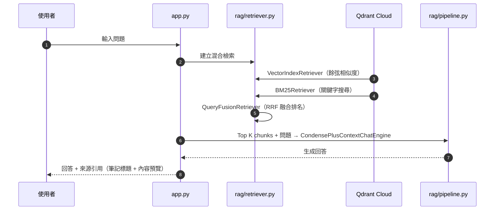

# 🧠 Personal Brain — 個人 HackMD 筆記 RAG 問答系統

以**個人 HackMD 筆記**為知識來源的 RAG 問答系統。以 **LlamaIndex** 為核心框架，結合 Qdrant 向量資料庫，讓你用自然語言詢問自己過去寫過的任何筆記內容，系統回傳答案並附上來源引用。知識庫每天定時更新，偵測到筆記有變動時只重建該篇，不重建整個 collection。

## 系統功能

| 功能 | 描述 |
| :--- | :--- |
| **混合檢索（Hybrid Search）** | 結合向量相似度搜尋與 `BM25` 關鍵字匹配，以 **RRF 演算法** 融合兩者排名。 |
| **HackMD 增量同步** | 可自動偵測筆記更新，只重建有變動的筆記 chunk，不重建整個 collection。 |
| **來源引用** | 每則回答附帶可展開的來源區塊，顯示筆記標題、相關性分數與內容預覽。 |
| **多輪對話記憶** | `CondensePlusContextChatEngine` 多輪問答，記憶跨越整個對話 session。 |
| **歷史對話管理** | Streamlit 側邊欄列出所有歷史對話，可切換、重新開啟或刪除。 |
| **LLM 自由切換** | 支援 OpenAI / Anthropic / Fine-tuned 模型，前端 selectbox 即時切換。 |

## 🌲 File Tree

```text
langchain-brain/
├── .env                         
├── config.py                     # LLM / Embedding 工廠函式 + LlamaIndex Settings
├── requirements.txt
├── main.py                       # CLI 問答入口
├── app.py                        # Streamlit 聊天介面（含歷史對話側邊欄）
├── scheduler.py                  
├── db/
│   └── chat_store.py             # Supabase CRUD：sessions / messages 對話持久化
├── ingestion/
│   ├── hackmd_loader.py          # HackMD API 筆記載入
│   └── sync_notes.py             # HackMD ↔ Qdrant 增量同步（新增 + 更新偵測）
└── rag/
    ├── indexer.py                # IngestionPipeline + Qdrant index 管理
    ├── retriever.py              # 混合檢索（Vector + BM25 + RRF）
    └── pipeline.py               # CondensePlusContextChatEngine 多輪對話
```

* `config.py`
控制 RAG 流程中所有模型變數，包括負責回答生成的 LLM 與負責向量化的 Embedding 模型，並透過 LlamaIndex 的全域物件 `Settings` 統一注入至 pipeline 各層。

## 🔄 RAG Pipeline

### 知識庫同步流程（增量更新）

```
flowchart TD
    A([🔔 觸發同步]) --> B[取得 HackMD 所有筆記清單]
    B --> C[撈取 Qdrant 現有筆記索引]
    C --> D{note_id 在 Qdrant 內？}

    D -- 不存在 --> E[新筆記：直接 ingest]
    D -- 存在但時間更新 --> F[已更新：先刪舊 chunk 再 ingest]
    D -- 存在且時間相同 --> G([跳過])

    E --> H[Chunking → Embedding → 寫入 Qdrant]
    F --> H
    H --> I([✅ 同步完成])
    G --> I

    style A fill:#4A90D9,color:#fff,stroke:none
    style F fill:#E0B422,color:#fff,stroke:none
    style E fill:#888,color:#fff,stroke:none
    style I fill:#2A9D8F,color:#fff,stroke:none
```

### 查詢流程



## 🛠️ 技術堆疊

| 領域 | 技術 | 說明 |
| :--- | :--- | :--- |
| **RAG 框架** | LlamaIndex | IngestionPipeline、ChatEngine、Retriever 整合 |
| **向量資料庫** | Qdrant Cloud | 儲存 chunk 向量與 metadata（note_id、title、tags、lastChangedAt） |
| **筆記來源** | HackMD API（Bearer token） | 私人筆記，每篇有唯一 note_id 和 lastChangedAt 時間戳 |
| **前端介面** | Streamlit | 聊天 UI、狀態管理、`@st.cache_resource` 快取 |
| **對話持久化** | Supabase | 跨會話儲存問答紀錄，側邊欄歷史對話管理 |

### 🚀 核心技術亮點

- **增量更新（先刪後建）**：用 `note_id` 作為 Qdrant payload filter，偵測到筆記更新時只刪除該篇的所有舊 chunk 再重新 embed，不重建整個 collection，節省 embedding 費用。
- **RRF 混合排名**：`向量搜尋` 與 `BM25` 分數尺度不相容，RRF 直接對排名做融合（`score = Σ 1/(k + rankᵢ)`），無需正規化，技術術語與語意查詢皆能準確命中。
- **多輪對話記憶**：使用 `CondensePlusContextChatEngine`，每次查詢前先將歷史對話壓縮成單一問題，再帶著 context 向量庫做檢索。
- **`@st.cache_resource` 快取**：將 query engine 建立包裝成快取函式，初次執行後結果保存在記憶體中，切換側邊欄對話不會重建 engine。

## Quick Start

### 環境設定

1. 在專案根目錄建立 `.env`：

```env
# 回答模型
LLM_PROVIDER="OpenAI/gpt-4o-mini"     # OpenAI/gpt-4o-mini | Anthropic/claude-sonnet-4-6

# Embedding 模型（切換時需重建 index）
EMBEDDING_PROVIDER="text-embedding-3-small"   # text-embedding-3-small | qwen

OPENAI_API_KEY=sk-...
ANTHROPIC_API_KEY=sk-ant-...           # 使用 Anthropic LLM 時必填
OPENROUTER_API_KEY=sk-or-...           # 使用 Qwen embedding 時必填

# HackMD API token（Settings > API > Create token）
HACKMD_API_TOKEN=...

# Qdrant 向量資料庫
QDRANT_URL=https://xxx.qdrant.io
QDRANT_API_KEY=...

# Supabase 對話持久化
SUPABASE_URL=https://xxx.supabase.co
SUPABASE_KEY=...
DEFAULT_USER_ID=...                    # 暫時的單一使用者 ID
```

2. 安裝依賴並啟動：

```bash
pip install -r requirements.txt

# 首次使用：手動執行一次完整同步，將 HackMD 筆記匯入知識庫
python ingestion/sync_notes.py

# 啟動 Streamlit 前端
streamlit run app.py
# 預設運行於 http://localhost:8501
```

### 常用指令

```bash
# 測試 HackMD loader（印出筆記數量與標題清單）
python ingestion/hackmd_loader.py

# 手動觸發一次增量同步
python ingestion/sync_notes.py

# CLI 問答模式
python main.py
```

## Qdrant Collection 設計

Collection 命名規則：`personal_notes_{embedding_provider}`。切換 embedding 時自動建立新 collection，舊的保留不動，兩者互不干擾。

| Collection | Embedding Provider | 說明 |
| :--- | :--- | :--- |
| `personal_notes_text-embedding-3-small` | OpenAI `text-embedding-3-small` | 預設 collection |
| `personal_notes_qwen` | Qwen `qwen3-embedding-8b`（OpenRouter） | 切換 Qwen 時自動建立 |

### Chunk Payload 設計

每個 chunk 在 Qdrant 內存以下 payload

| 欄位 | 說明 |
| :--- | :--- |
| `note_id` | HackMD 唯一筆記 ID，用於增量更新的 filter delete |
| `title` | 筆記標題 |
| `tags` | 筆記標籤（逗號分隔字串） |
| `source` | 來源類型，目前固定為 `hackmd` |
| `lastChangedAt` | HackMD 上該筆記的最後修改時間（ISO 8601），用於變動偵測 |

## Supabase 資料庫設計

對話紀錄以雙表結構儲存，`sessions` 管理對話列表，`messages` 儲存每則訊息。

| 資料表 | 主要欄位 |
| :--- | :--- |
| `user` | `id`, `name`, `email`, `created_at`|
| `sessions` | `id`, `user_id`, `title`, `created_at`|
| `messages` | `id`, `session_id`, `role`, `content`, `sources`, `created_at` |

## 🔑 Third-Party Licenses

本專案引用的第三方套件詳見 `requirements.txt`。