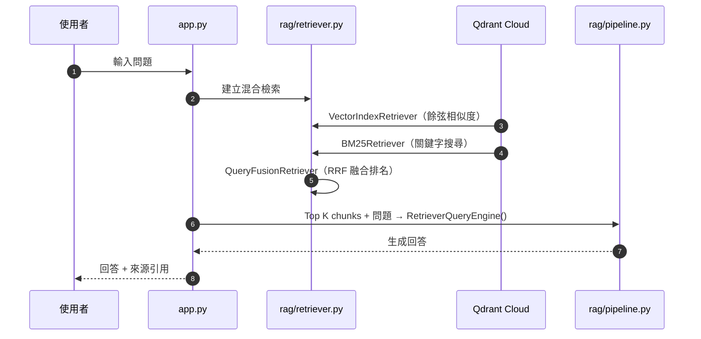
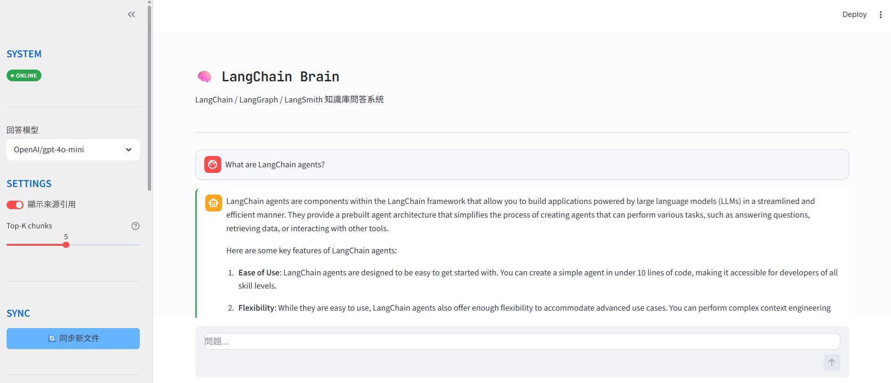

# 🧠 LangChain Brain — RAG 文件問答系統

針對 **LangChain 生態系** 官方文件所建立的 RAG 問答系統。以 **LlamaIndex** 為核心框架，結合 Qdrant 向量資料庫與 Google Drive 文件來源，讓開發者用自然語言詢問 LangChain、LangGraph、LangSmith 相關問題，並取得附有來源引用的精確答案。

## 系統功能

| 功能 | 描述 |
| :--- | :--- |
| **混合檢索（Hybrid Search）** | 結合向量相似度搜尋與 `BM25` 關鍵字匹配，以 **RRF 演算法** 融合兩者排名。 |
| **Google Drive 文件自動同步** | 所有文件來源自 Google Drive，新文件進入也可透過比對快速更新知識庫。 |
| **來源引用** | 每則回答附帶可展開的來源區塊，顯示文件名稱、RRF 相關性分數與內容預覽。 |
| **Streamlit 聊天介面** | GitHub 風格聊天 UI，支援對話歷史、範例問題快速輸入、Top-K chunks 可調整 |

## 🌲 File Tree

```text
langchain-brain/
├── google-service-account.json   # 服務帳戶憑證
├── .env                          
├── config.py                     # LLM / Embedding 工廠函式 + LlamaIndex Settings
├── requirements.txt
├── main.py                     
├── app.py                        # Streamlit 聊天介面
├── db/
│   └── chat_store.py             # 處理對話訊息的資料庫 CRUD 操作
├── ingestion/
│   ├── doc_loader.py             # Google Drive API 文件載入
│   └── sync_docs.py              # Drive ↔ Qdrant 差異同步
└── rag/
    ├── indexer.py                # IngestionPipeline + Qdrant index 管理
    ├── retriever.py              # 混合檢索（Vector + BM25 + RRF）
    └── pipeline.py               # RetrieverQueryEngine
```

* `config.py`
控制 RAG 流程中所有模型變數，包括負責回答生成的 LLM 與負責向量化的 Embedding 模型，並透過 LlamaIndex 的全域物件 `Settings` 統一注入至 pipeline 各層。

## 🔄 RAG Pipeline

### 文件同步流程
實際應用中知識庫的文件會不定時更新。若每次重啟伺服器都自動執行同步，則每次開啟頁面時都需要重新跑完整的 `Chunking → Embedding`，十分耗時嚴重影響使用者體驗。因此 app 的側邊欄提供 `🔄 同步新文件` 按鈕，由使用者自行決定同步時機。

```
            點擊「🔄 同步新文件」
                      │
                      ▼
┌─────────────────────────────────────────────────┐
│  ingestion/doc_loader.py                        │
│  Google Drive API → 取得所有 MD/MDX file_id 清單  │                
└─────────────────────┬───────────────────────────┘
                      │
                      ▼
┌─────────────────────────────────────────────────┐
│  ingestion/sync_docs.py                         │
│  比對 Drive 內檔案與 Qdrant collection 內文件     │
│   → 判斷是否有新文件需更新                        │
│   →  呼叫 IngestionPipeline                     │ 
└─────────────────────┬───────────────────────────┘
                      │
                      ▼
             知識庫更新完成
```

### 查詢流程





## 🛠️ 技術堆疊

| 領域 | 技術 | 說明 |
| :--- | :--- | :--- |
| **RAG 框架** | LlamaIndex | IngestionPipeline、QueryEngine、Retriever 整合 |
| **向量資料庫** | Qdrant Cloud | 將知識庫上雲端，儲存 chunk 向量與 metadata |
| **關鍵字搜尋** | BM25Retriever | 本地全文搜尋，與向量搜尋互補 |
| **原始文件儲存** | Google Drive API（Service Account） | 遞迴掃描資料夾，下載 MD / MDX 文件 |
| **前端介面** | Streamlit | 聊天 UI、狀態管理、`@st.cache_resource` 快取 |
| **對話持久化** | Supabase | 跨會話儲存問答紀錄，側邊欄歷史對話管理 |

### 🚀 核心技術亮點

- **RRF 混合排名**：`向量搜尋` 與 `BM25` 分數尺度不相容，**RRF** 直接對排名做融合（`score = Σ 1/(k + rankᵢ)`），無需正規化，技術文件的精確術語與語意查詢皆能準確命中。
- **快取**：streamlit app 以 `@st.cache_resource` 將 query_engine 建立包裝成快取函式，初次執行後結果會保存在記憶體中供重新渲染直接使用。
- **歷史對話記憶管理**： 使用 `CondensePlusContextChatEngine` 建構多輪對話引擎，使每一次查詢都包含歷史記憶。
- **LLM 拒答機制**：Retriever 永遠回傳 Top-K 結果，若檢索結果上下文不足時主動說明無法回答，避免幻覺。


## Quick Start

### 環境設定

1. 在專案根目錄建立 `.env`：
```env
EMBEDDING_PROVIDER=openai        # openai | qwen

OPENAI_API_KEY=sk-...
ANTHROPIC_API_KEY=sk-ant-...     # 使用 Anthropic 時必填
OPENROUTER_API_KEY=sk-or-...     # 使用 Qwen embedding 時必填

QDRANT_URL=https://xxx.qdrant.io
QDRANT_API_KEY=...

GOOGLE_DRIVE_FOLDER_ID=...       # Google Drive 根資料夾 ID

SUPABASE_URL=https://xxx.supabase.co
SUPABASE_KEY=...
DEFAULT_USER_ID=...              # 暫時的單一使用者 ID
```

2. **Service Account**
記得先去 GCP 申請一個 **服務帳戶 (SA)**，並且取得 `json` 憑證存在專案中，這樣才有權限去讀取你 Google Drive 內的檔案。

### 🔌 啟動服務

```bash
pip install -r requirements.txt
streamlit run app.py
# 預設應用運行於 http://localhost:8501
```

## Qdrant Collection 設計

| Collection | Embedding Provider | 向量維度 | 說明 |
| :--- | :--- | :--- | :--- |
| `langchain_docs_text-embedding-3-small` | OpenAI `text-embedding-3-small` | 1536 | 預設 collection |
| `langchain_docs_qwen3-embedding-8b` | Qwen `qwen3-embedding-8b`（OpenRouter） | 4096 | 切換 Qwen 時自動建立 |

## Supabase 資料庫設計

對話紀錄以雙表結構儲存，`sessions` 管理對話列表，`messages` 儲存每則訊息。

| 資料表 | 主要欄位 |
| :--- | :--- |
| `user` | `id`, `name`, `email`, `created_at`|
| `sessions` | `id`, `user_id`, `title`, `created_at`|
| `messages` | `id`, `session_id`, `role`, `content`, `sources`, `created_at` |

## 🔑 Third-Party Licenses

本專案引用的第三方套件詳見 `requirements.txt`。


## 🔑 補充
Langchain 文件來源 : 官方資料
```
git clone https://github.com/langchain-ai/docs.git
```
只取其中兩個資料夾
src/oss/        ← LangChain + LangGraph 文件
src/langsmith/  ← LangSmith 文件
